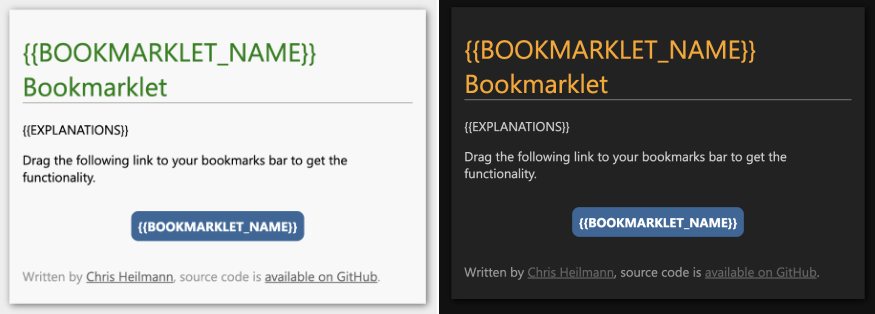

# Bookmarklet hosting template

This is a template to use to host your bookmarklets on GitHub pages or anywhere else that supports JS/HTML/CSS.

1. Edit `bml-code.js` to be your bookmarklet code. You can use [snippets](https://docs.microsoft.com/microsoft-edge/devtools-guide-chromium/javascript/snippets) to test it and have a full editor in the browser.
1. Rename the `{{BOOKMARKLET_NAME}}` instances in `index.html`
1. Add your bookmarklet explanations as `{{EXPLANATIONS}}`
1. Change the author name, URL and source code location in the footer

The HTML page features a few benefits:

1. It creates a link of your bookmarklet code that people can click or bookmark. This link only shows up when everything went well
1. It has a dark/light mode
1. It converts your code in `bml-code.js` to a bookmarklet

 

The script in the index.html automatically converts your `bml-code.js` code to a bookmarklet and sets the `href` of the link to it. That way people can drag it into their favourites/bookmark toolbars. The script automatically:

1. Removes newlines and indentation
1. encodes the script to be URL conform
1. puts an [IIFE](https://developer.mozilla.org/en-US/docs/Glossary/IIFE) around your script
1. adds `javascript:` in front of it

This means you can concentrate on writing your code without having to convert it. If you want to use this template locally, you need to run a local server, as `fetch` won't work without it.

[See it in action here](https://codepo8.github.io/Quick-edit-bookmarklet/)
